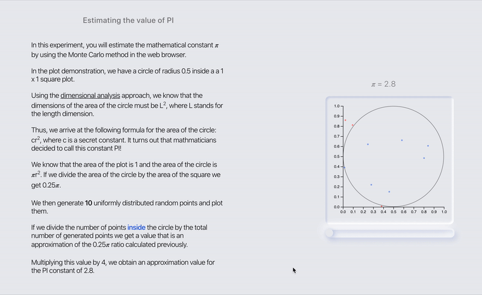

# Visualizing Pi

Visualizing PI is an experimental SPA built in order to dive myself into the [D3.js](https://github.com/d3/d3) library. It consists in a simple and light web application built using React and D3.js.

In the application, the user will be using the Monte Carlo method in order to estimate the famous mathematical constant of 𝜋. Additionally, he is able to interact with the computations and also able to visualize the approximation method in a colored graph plot.



In order to run the application please follow these three simple steps:

- Clone this repository
- Open the `/webapp` folder
- Run the following command on your terminal:

```
npm start
```